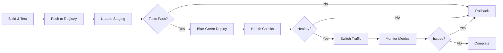

# 11. Migration & Rollback Strategy

## Database Migrations

```php
class CreatePaymentsTable extends AbstractMigration {
    public function up(Schema $schema): void {
        $table = $schema->createTable('payments');
        $table->addColumn('id', 'uuid');
        $table->addColumn('user_id', 'uuid');
        $table->addColumn('email_id', 'uuid', ['notnull' => false]);
        $table->addColumn('amount', 'decimal', ['precision' => 10, 'scale' => 2]);
        $table->addColumn('currency', 'string', ['length' => 3, 'default' => 'CZK']);
        $table->addColumn('bank_account', 'string', ['length' => 50]);
        $table->addColumn('variable_symbol', 'string', ['length' => 10, 'notnull' => false]);
        $table->addColumn('due_date', 'date');
        $table->addColumn('status', 'string', ['length' => 20]);
        $table->addColumn('created_at', 'datetime');
        $table->addColumn('updated_at', 'datetime');
        
        $table->setPrimaryKey(['id']);
        $table->addIndex(['user_id', 'status', 'due_date']);
        $table->addForeignKeyConstraint('users', ['user_id'], ['id']);
    }
    
    public function down(Schema $schema): void {
        $schema->dropTable('payments');
    }
}
```

## Deployment Strategy


