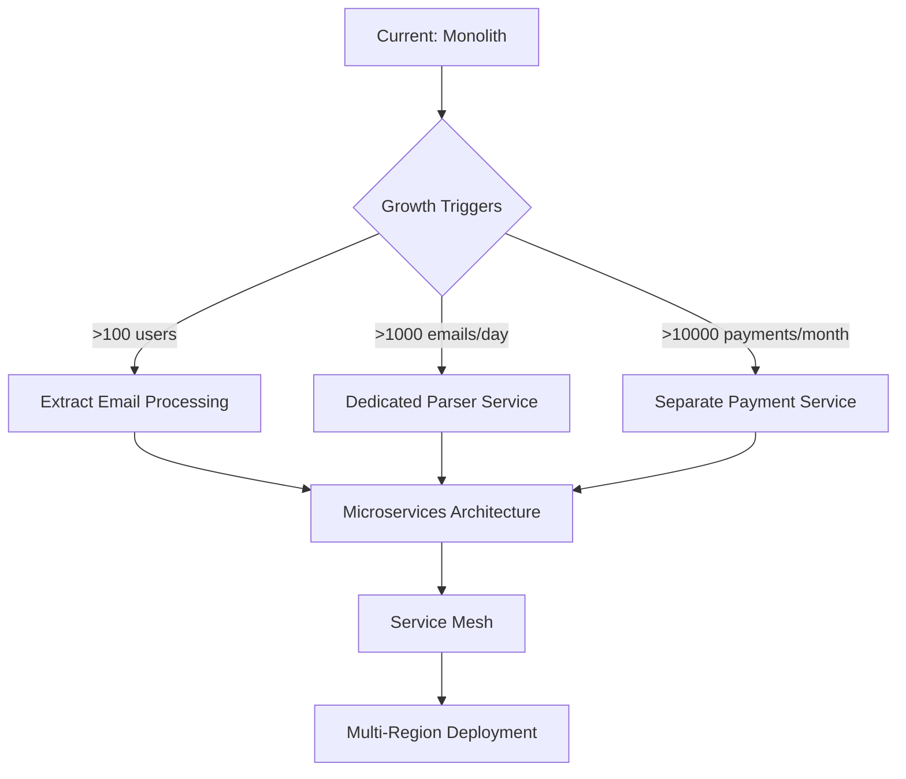

# 13. Technical Debt & Future Considerations

## Identified Technical Debt

1. **Email Parser Fragility**: Hard-coded patterns for bank emails will break when formats change
   - *Mitigation*: Implement versioned parsers with fallback chains
   
2. **Monolithic Coupling**: Modules communicate directly rather than through events
   - *Mitigation*: Gradually introduce event bus for inter-module communication
   
3. **Manual Duplicate Detection**: Rule-based detection will miss edge cases
   - *Mitigation*: Phase 2 - ML-based duplicate detection
   
4. **No API Versioning**: External integrations have no version management
   - *Mitigation*: Implement API gateway with version routing

## Scalability Considerations

## Future Architecture Evolution

**Phase 2 (3-6 months)**:
- LLM integration for intelligent parsing
- WebSocket for real-time updates
- GraphQL API for flexible client queries

**Phase 3 (6-12 months)**:
- Event sourcing for complete audit trail
- CQRS for read/write separation
- Async job processing with dedicated workers

**Phase 4 (12+ months)**:
- Multi-tenancy for SaaS offering
- Kubernetes operator for automated operations
- Edge deployment for global latency optimization
