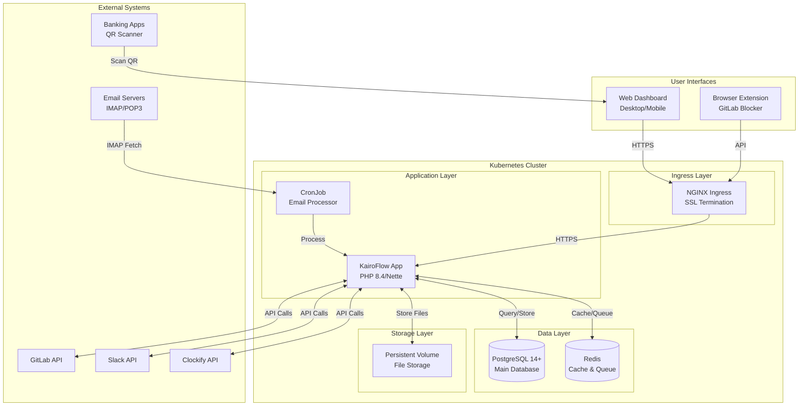
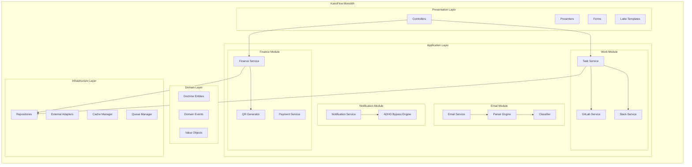

# 2. System Architecture

## High-Level Architecture

## Component Architecture

## Module Boundaries

| Module | Responsibilities | Dependencies | Events Emitted |
|--------|-----------------|--------------|----------------|
| **Finance** | Payment management, QR generation, cash flow tracking | Email, Notification | PaymentCreated, PaymentCompleted, BufferUpdated |
| **Work** | Task tracking, GitLab/Slack sync, follow-up generation | Email, Notification | TaskCreated, TaskSynced, FollowUpDue |
| **Email** | IMAP fetching, parsing, classification | None | EmailReceived, EmailClassified, ParseFailed |
| **Notification** | Multi-channel alerts, ADHD strategies, streak tracking | All modules | NotificationSent, StreakUpdated, MorningCheckCompleted |
