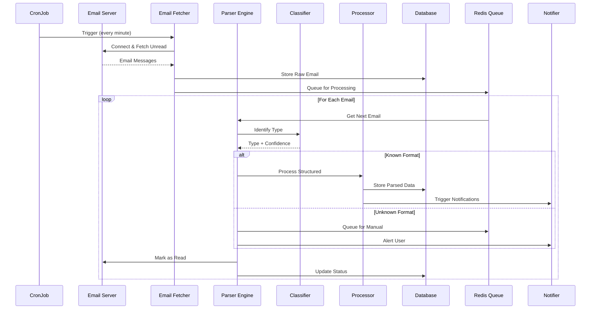
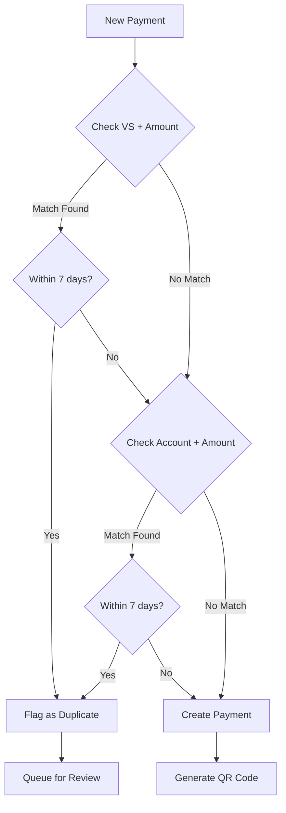

# 3. Email Processing Pipeline

## Pipeline Architecture



## Email Parser Components

### Bank Statement Parser

```php
interface BankParserInterface {
    public function supports(Email $email): bool;
    public function parse(Email $email): BankStatement;
    public function getConfidence(): float;
}

class CSOBParser implements BankParserInterface {
    // Pattern matching for ČSOB email format
    private const PATTERNS = [
        'balance' => '/Zůstatek:\s*([\d\s,]+)\s*CZK/',
        'account' => '/Účet:\s*([\d\-\/]+)/',
        'transaction' => '/(\d{2}\.\d{2}\.\d{4})\s+(.*?)\s+([\-\+]?[\d\s,]+)/'
    ];
}
```

### Classification Engine

```yaml
Classification Rules:
  - sender: "*@csob.cz"
    type: bank_statement
    parser: CSOBParser
    confidence: 0.95
    
  - sender: "*@kb.cz"
    type: bank_statement
    parser: KBParser
    confidence: 0.95
    
  - subject_contains: "faktura|invoice"
    type: invoice
    parser: InvoiceParser
    confidence: 0.8
    
  - subject_contains: "upomínka|reminder"
    type: payment_reminder
    parser: ReminderParser
    confidence: 0.85
```

## Duplicate Detection Algorithm



## Error Handling & Recovery

| Error Type | Recovery Strategy | Fallback | Notification |
|------------|------------------|----------|--------------|
| IMAP Connection Failed | Exponential backoff (1, 2, 4, 8 min) | Skip cycle | After 3 failures |
| Parse Failed | Queue for manual review | Manual categorization UI | Immediate |
| Duplicate Detected | Flag for user confirmation | Show both payments | Dashboard badge |
| Attachment Corrupted | Retry download 3x | Show email without attachment | Log warning |
| Rate Limit Hit | Wait until reset | Process remaining in next cycle | Log info |
