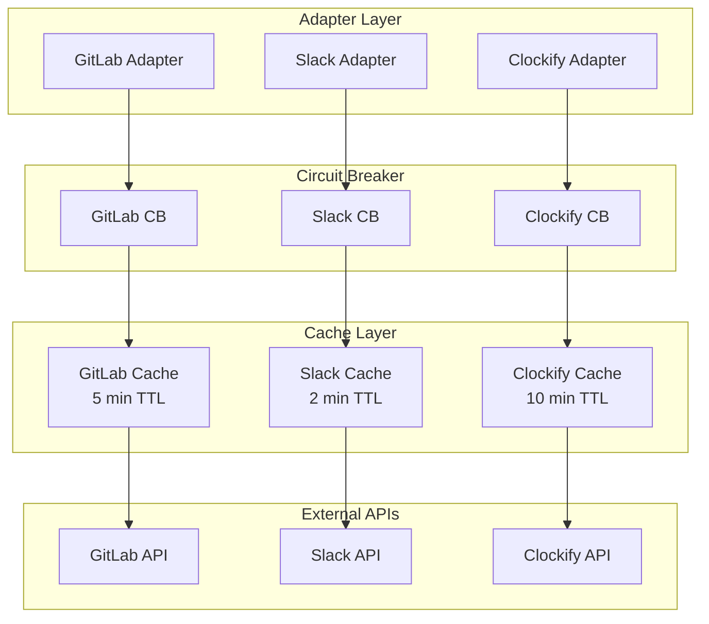

# 4. API Integration Patterns

## Integration Architecture



## GitLab Integration

### API Configuration

```yaml
gitlab:
  base_url: "https://gitlab.com/api/v4"
  token: "${GITLAB_TOKEN}"
  rate_limit: 600/min
  timeout: 10s
  retry:
    max_attempts: 3
    backoff: exponential
  projects:
    - id: 12345
      track_commits: true
      track_issues: true
```

### Task Sync Flow

```php
class GitLabSyncService {
    public function syncTasks(): SyncResult {
        // 1. Fetch recent Slack messages
        $slackTasks = $this->slackService->getRecentMentions();
        
        // 2. Fetch GitLab issues
        $gitlabIssues = $this->gitlabAdapter->getOpenIssues();
        
        // 3. Compare and find gaps
        $unmatchedTasks = $this->taskMatcher->findGaps(
            $slackTasks, 
            $gitlabIssues
        );
        
        // 4. Queue for user review
        foreach ($unmatchedTasks as $task) {
            $this->taskQueue->add($task);
        }
        
        return new SyncResult($unmatchedTasks);
    }
}
```

## Slack Integration

### Message Monitoring

```php
class SlackMonitor {
    private const KEYWORDS = ['task', 'please', 'can you', 'need', 'urgent'];
    
    public function extractTasks(array $messages): array {
        $tasks = [];
        
        foreach ($messages as $message) {
            if ($this->isTask($message)) {
                $tasks[] = new Task(
                    source: 'slack',
                    content: $message['text'],
                    author: $message['user'],
                    timestamp: $message['ts'],
                    channel: $message['channel']
                );
            }
        }
        
        return $tasks;
    }
    
    private function isTask(array $message): bool {
        // Check for direct mentions
        if (str_contains($message['text'], '<@' . $this->userId . '>')) {
            return true;
        }
        
        // Check for task keywords
        foreach (self::KEYWORDS as $keyword) {
            if (stripos($message['text'], $keyword) !== false) {
                return true;
            }
        }
        
        return false;
    }
}
```

## Clockify Integration

### Weekly Invoice Generation

```php
class ClockifyInvoiceService {
    public function generateWeeklyInvoice(): Invoice {
        // 1. Fetch current week's time entries
        $entries = $this->clockifyAdapter->getTimeEntries(
            start: Carbon::now()->startOfWeek(),
            end: Carbon::now()->endOfWeek()
        );
        
        // 2. Group by project and calculate totals
        $projects = $this->groupByProject($entries);
        
        // 3. Generate invoice
        $invoice = new Invoice();
        foreach ($projects as $project) {
            $invoice->addLine(
                description: $project->name,
                hours: $project->totalHours,
                rate: $project->hourlyRate,
                amount: $project->totalHours * $project->hourlyRate
            );
        }
        
        // 4. Create PDF
        $pdf = $this->pdfGenerator->generate($invoice);
        
        // 5. Send to client
        $this->emailService->send($invoice->client->email, $pdf);
        
        return $invoice;
    }
}
```

## Circuit Breaker Implementation

```php
class CircuitBreaker {
    private int $failureThreshold = 5;
    private int $timeout = 60; // seconds
    private int $failureCount = 0;
    private ?Carbon $lastFailure = null;
    private string $state = 'CLOSED'; // CLOSED, OPEN, HALF_OPEN
    
    public function call(callable $operation) {
        if ($this->state === 'OPEN') {
            if ($this->shouldAttemptReset()) {
                $this->state = 'HALF_OPEN';
            } else {
                throw new CircuitOpenException();
            }
        }
        
        try {
            $result = $operation();
            $this->onSuccess();
            return $result;
        } catch (\Exception $e) {
            $this->onFailure();
            throw $e;
        }
    }
}
```
