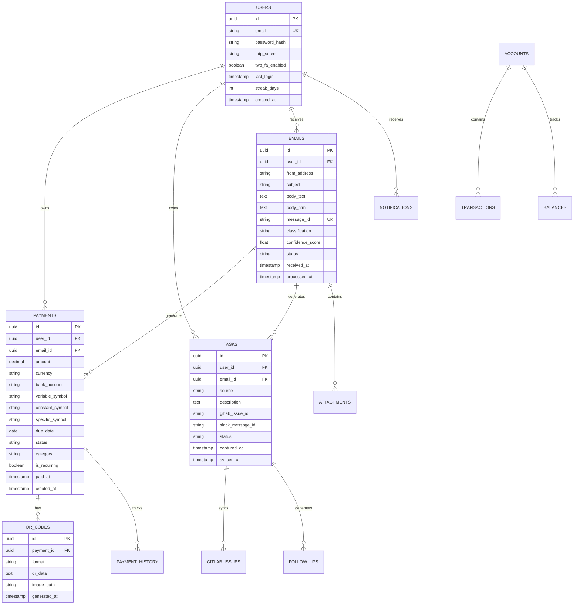

# 5. Data Architecture

## Database Schema



## Caching Strategy

| Data Type | Cache TTL | Invalidation Trigger | Storage |
|-----------|-----------|---------------------|---------|
| Dashboard Summary | 30 seconds | Payment/Task change | Redis |
| GitLab Issues | 5 minutes | Manual sync | Redis |
| Slack Messages | 2 minutes | New message webhook | Redis |
| Clockify Hours | 10 minutes | Time entry change | Redis |
| QR Code Images | 1 hour | Payment completion | Redis + File |
| Bank Balances | Until next email | New bank email | Redis |
| User Session | 24 hours | Logout | Redis |

## Event Sourcing Light

```php
abstract class DomainEvent {
    public readonly string $aggregateId;
    public readonly Carbon $occurredAt;
    public readonly array $metadata;
}

class PaymentCreatedEvent extends DomainEvent {
    public function __construct(
        public readonly string $paymentId,
        public readonly float $amount,
        public readonly string $bankAccount,
        public readonly Carbon $dueDate
    ) {
        $this->aggregateId = $paymentId;
        $this->occurredAt = Carbon::now();
    }
}

class EventBus {
    private array $handlers = [];
    
    public function dispatch(DomainEvent $event): void {
        $eventClass = get_class($event);
        
        if (isset($this->handlers[$eventClass])) {
            foreach ($this->handlers[$eventClass] as $handler) {
                $handler($event);
            }
        }
        
        // Store in event log
        $this->eventStore->append($event);
    }
}
```
