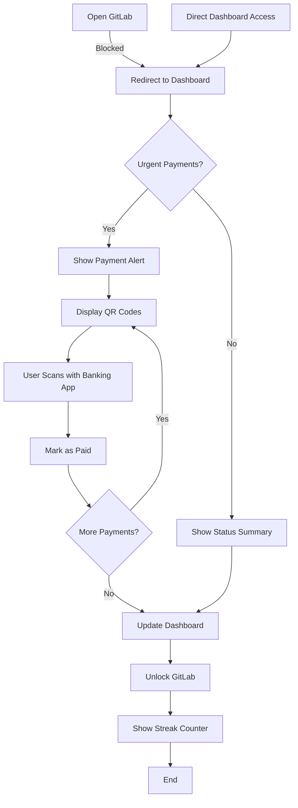
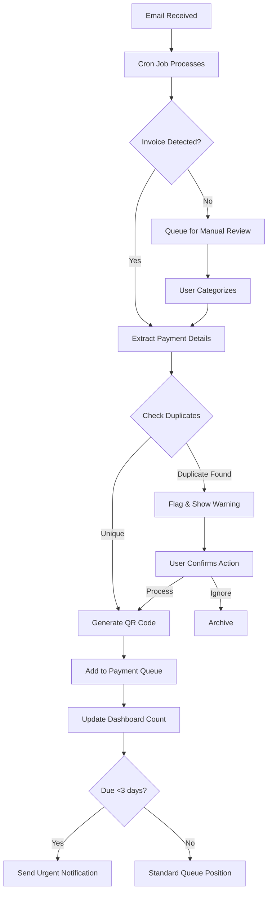
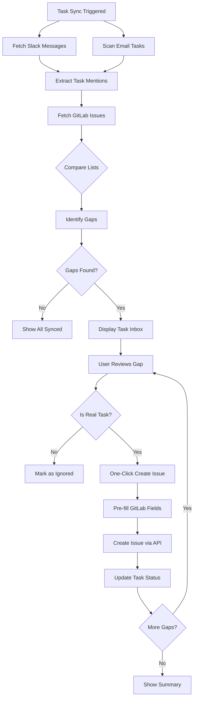

# KairoFlow UI/UX Specification

## Introduction

This document defines the user experience goals, information architecture, user flows, and visual design specifications for KairoFlow's user interface. It serves as the foundation for visual design and frontend development, ensuring a cohesive and user-centered experience.

## Overall UX Goals & Principles

### Target User Personas

**1. The Overwhelmed Freelancer (Primary)**
- ADHD professional struggling with executive dysfunction
- High technical competence but low financial literacy
- Needs bypasses for procrastination and task avoidance
- Motivated by streak maintenance and visual progress

**2. The Penalty Payer**
- Consistently late with payments despite having funds
- Loses 500-2000+ CZK monthly to penalties
- Needs friction-free payment execution
- Requires unavoidable reminders

**3. The Task Juggler**
- Receives work tasks via multiple channels (Slack, email)
- Forgets to log tasks in GitLab
- Needs automated task capture and comparison
- Benefits from morning routine enforcement

### Usability Goals

- **Zero-Friction Payments:** Complete any payment in 2 taps/clicks via QR code
- **Unavoidable Urgency:** Visual indicators impossible to ignore or dismiss
- **Morning Habit Formation:** Dashboard check required before work access
- **Cognitive Load Reduction:** Progressive disclosure with only critical info upfront
- **Error Prevention:** Duplicate payment detection before QR generation

### Design Principles

1. **ADHD-First Design** - Every interaction assumes executive dysfunction as default
2. **Visual Over Textual** - Use color, size, and motion to communicate urgency
3. **Bypass Over Discipline** - Work around ADHD rather than trying to fix it
4. **Calm Not Chaos** - Reduce anxiety with neutral, non-judgmental presentation
5. **Progress Not Perfection** - Celebrate small wins and streaks over absolute success

### Change Log

| Date | Version | Description | Author |
|------|---------|-------------|--------|
| 2025-01-29 | 1.0 | Initial UI/UX specification based on PRD | Sally (UX Expert) |

## Information Architecture (IA)

### Site Map / Screen Inventory

```mermaid
graph TD
    A[Login/Auth] --> B[Daily Dashboard]
    B --> C[Payment Queue]
    B --> D[Task Inbox]
    B --> E[Cash Flow]
    B --> F[Settings]
    
    C --> C1[Pending Payments]
    C --> C2[QR Batch Display]
    C --> C3[Payment History]
    C --> C4[Duplicate Detection]
    
    D --> D1[Unprocessed Tasks]
    D --> D2[GitLab Comparison]
    D --> D3[Follow-up Queue]
    D --> D4[Task Archive]
    
    E --> E1[Weekly Overview]
    E --> E2[Buffer Tracker]
    E --> E3[Income Projection]
    E --> E4[Expense Categories]
    E --> E5[Invoice Generator]
    
    F --> F1[Email Config]
    F --> F2[API Integrations]
    F --> F3[ADHD Strategies]
    F --> F4[Category Rules]
    F --> F5[Notification Channels]
    
    B --> G[Quick Actions Bar]
    G --> G1[Generate All QRs]
    G --> G2[Mark All Paid]
    G --> G3[Sync GitLab]
    G --> G4[Generate Invoice]
```

### Navigation Structure

**Primary Navigation:** Persistent left sidebar with icon + text navigation for main sections (Dashboard, Payments, Tasks, Cash Flow, Settings). Icons provide visual anchors for ADHD users. Current section highlighted with color accent and subtle animation.

**Secondary Navigation:** Contextual sub-navigation within each main section, displayed as tabs below the page header. Reduces cognitive load by showing only relevant options for current context.

**Breadcrumb Strategy:** Minimal breadcrumbs only for Settings and deep-dive views. Main sections are always one click away via sidebar, so extensive breadcrumbs would add visual clutter without value.

## User Flows

### Flow 1: Morning Financial Check & Payment Processing

**User Goal:** Complete mandatory morning financial review and process urgent payments

**Entry Points:** 
- Browser bookmark (primary)
- GitLab redirect when blocked
- Morning notification link

**Success Criteria:** Dashboard viewed, urgent payments processed, GitLab access unlocked

#### Flow Diagram

**Edge Cases & Error Handling:**
- Banking app unavailable → Show bank account details for manual transfer
- QR code scan fails → Provide copyable payment details
- User tries to bypass → Log bypass attempt, require double confirmation

**Notes:** The morning block is the cornerstone habit-forming mechanism. No configuration allowed to prevent users from disabling it during "good intention" moments.

### Flow 2: Email Invoice to QR Payment

**User Goal:** Convert received invoice email into scannable QR payment code

**Entry Points:**
- Email arrives in monitored inbox
- Manual email forward to system
- Upload invoice via dashboard

**Success Criteria:** Valid QR code generated with correct payment details, no duplicates created

#### Flow Diagram

**Edge Cases & Error Handling:**
- Partial invoice data → Highlight missing fields, allow manual completion
- Multiple invoices in one email → Create separate payments for each
- Foreign currency → Show conversion warning, calculate CZK amount
- Invalid bank account → Validation error with correction suggestions

**Notes:** Duplicate detection is crucial for ADHD users who may forward same invoice multiple times when anxious about payment.

### Flow 3: GitLab Task Gap Detection

**User Goal:** Identify work tasks not yet logged in GitLab and create issues

**Entry Points:**
- Daily task sync (automated)
- Manual sync trigger from dashboard
- Morning check routine

**Success Criteria:** All Slack/email tasks matched or created in GitLab

#### Flow Diagram

**Edge Cases & Error Handling:**
- GitLab API rate limit → Queue for later, show pending badge
- Ambiguous task mention → Include context snippet for user decision
- Duplicate task different wording → Show similarity score, suggest merge
- Private/sensitive task → Allow "Do not sync" flag

**Notes:** One-click issue creation is critical - any friction here means tasks won't get logged.

## Wireframes & Mockups

### Key Screen Layouts

#### Daily Dashboard

**Purpose:** Mandatory morning check screen showing financial health and urgent items at a glance

**Key Elements:**
- Streak counter (top, prominent) with celebration animation for milestones
- Urgent payment cards with days remaining (color-coded border)
- Buffer health bar showing progress toward 500 CZK minimum
- Today's required amount vs available funds
- Quick action buttons (Generate All QRs, Process Payments)
- Unsynced task count badge

**Interaction Notes:** Auto-refreshes every 30 seconds. Urgent items pulse gently. Clicking anywhere on payment card shows QR immediately. No confirmations or extra steps.

#### Payment Queue Screen

**Purpose:** Display all pending payments with QR codes for rapid processing

**Key Elements:**
- Grid of QR codes (2x2 on desktop, 1x1 on mobile)
- Payment amount prominently displayed above each QR
- Days until due with color indicator
- "Mark as Paid" button below each QR
- Batch actions toolbar (Generate All, Mark All Paid)
- Filter chips (Urgent, Business, Personal, Recurring)

**Interaction Notes:** QR codes are always visible, no click to reveal. Marking as paid immediately moves to history with subtle slide animation. No confirmation dialogs.

#### Task Inbox Screen

**Purpose:** Show work tasks captured but not yet in GitLab

**Key Elements:**
- Task source icon (Slack/Email)
- Task description with context snippet
- "Create Issue" button (primary action, green)
- "Not a Task" button (secondary, gray)
- Detected project suggestion dropdown
- Days since captured indicator
- Bulk create toolbar for multiple selections

**Interaction Notes:** One click creates issue with smart defaults. Project suggestion based on keywords. Successful creation shows brief success toast then removes item.

## Component Library / Design System

### Design System Approach

Custom lightweight component system built with Tailwind CSS utilities, Alpine.js for interactions. No heavy framework - focus on simple, reusable patterns that load fast and work reliably.

### Core Components

#### Payment Card

**Purpose:** Display payment information with integrated QR code for immediate action

**Variants:** 
- Urgent (red border, pulsing)
- Warning (yellow border)  
- Standard (gray border)
- Completed (green check, faded)

**States:**
- Default (full opacity, QR visible)
- Processing (spinner overlay on QR)
- Paid (checkmark overlay, fade to 50%)
- Error (red overlay with retry button)

**Usage Guidelines:** Always show QR code, never hide behind interaction. Amount must be largest text element. Due date uses relative time (2 days) not absolute dates.

#### Progress Bar (Buffer Health)

**Purpose:** Visual representation of financial buffer building toward safety goal

**Variants:**
- Critical (0-100 CZK) - red with pulse
- Building (100-400 CZK) - yellow
- Healthy (400+ CZK) - green
- Goal reached (500+ CZK) - green with sparkle animation

**States:**
- Static (current amount)
- Animating (value changing)
- Projected (ghosted future value)

**Usage Guidelines:** Always show actual number alongside visual. Use smooth animations for value changes. Include growth rate indicator (+10% text).

#### Task Badge

**Purpose:** Show unprocessed tasks requiring attention

**Variants:**
- Slack source (purple icon)
- Email source (blue icon)
- GitLab synced (green check)
- Urgent follow-up (red exclamation)

**States:**
- New (bright background)
- Viewed (normal background)
- Processing (spinner)
- Resolved (fade out animation)

**Usage Guidelines:** Group by source when multiple. Show count for collapsed groups. One-click expand to show all.

#### Quick Action Button

**Purpose:** Primary actions accessible from anywhere

**Variants:**
- Primary (solid green - Generate QR, Create Issue)
- Danger (solid red - Mark All Paid)
- Secondary (outline - Sync, Refresh)

**States:**
- Default
- Hover (slight grow)
- Active (depress effect)
- Loading (spinner replace text)
- Disabled (50% opacity)

**Usage Guidelines:** Minimum 44px touch target. Text + icon always. Loading state preserves button size. Disabled state shows tooltip explaining why.

#### Urgency Indicator

**Purpose:** Impossible-to-ignore visual cue for time-sensitive items

**Variants:**
- Overdue (red pulse animation)
- Today (orange strong pulse)  
- Tomorrow (yellow gentle pulse)
- This week (static yellow)
- Later (static gray)

**States:**
- Active (pulsing based on urgency)
- Acknowledged (static color)

**Usage Guidelines:** Combine with text for accessibility. Pulse speed increases with urgency. Never fully hide - acknowledged items remain colored.

## Branding & Style Guide

### Visual Identity

**Brand Guidelines:** KairoFlow uses calm, professional styling that reduces anxiety while maintaining urgency awareness. No aggressive alerts or shame-based messaging.

### Color Palette

| Color Type | Hex Code | Usage |
|------------|----------|--------|
| Primary | #10B981 | Success states, positive actions, healthy buffer |
| Secondary | #6366F1 | Information, links, Slack indicators |
| Accent | #8B5CF6 | Streak celebrations, achievements |
| Success | #22C55E | Completed payments, synced tasks |
| Warning | #EAB308 | 3-6 days deadline, building buffer |
| Error | #EF4444 | Overdue items, critical buffer |
| Neutral | #6B7280, #E5E7EB | Text, borders, backgrounds |

### Typography

#### Font Families
- **Primary:** Inter (clean, highly legible for ADHD readers)
- **Secondary:** Inter (maintaining consistency)
- **Monospace:** JetBrains Mono (for amounts, codes)

#### Type Scale

| Element | Size | Weight | Line Height |
|---------|------|--------|-------------|
| H1 | 32px | 700 | 1.2 |
| H2 | 24px | 600 | 1.3 |
| H3 | 20px | 600 | 1.4 |
| Body | 16px | 400 | 1.5 |
| Small | 14px | 400 | 1.4 |

### Iconography

**Icon Library:** Heroicons (outline style for consistency)

**Usage Guidelines:** Icons always paired with text for clarity. Consistent 20px size in buttons, 24px standalone. Simple, recognizable symbols only - no abstract concepts.

### Spacing & Layout

**Grid System:** 12-column grid with 24px gutters on desktop, 4-column with 16px on mobile

**Spacing Scale:** 4px base unit (4, 8, 12, 16, 24, 32, 48, 64px) - limited options to maintain consistency

## Accessibility Requirements

### Compliance Target

**Standard:** WCAG 2.1 AA compliance with focus on ADHD-specific accommodations beyond standard requirements

### Key Requirements

**Visual:**
- Color contrast ratios: Minimum 4.5:1 for normal text, 3:1 for large text, 7:1 for critical payment amounts
- Focus indicators: High visibility 3px solid outline in primary color, never rely on color alone
- Text sizing: Base 16px minimum, payment amounts 20px+, user-scalable up to 200%

**Interaction:**
- Keyboard navigation: Full keyboard access with logical tab order, skip links for repetitive elements
- Screen reader support: Semantic HTML, ARIA labels for QR codes describing payment details
- Touch targets: Minimum 44x44px, 48px for primary actions, adequate spacing between targets

**Content:**
- Alternative text: QR codes include full payment details as alt text
- Heading structure: Logical h1-h3 hierarchy, no skipping levels
- Form labels: Always visible labels, no placeholder-only inputs, error messages linked to fields

### Testing Strategy

Regular testing with NVDA/JAWS screen readers, keyboard-only navigation testing, color blindness simulators, and actual ADHD user feedback sessions. Automated accessibility scanning in CI/CD pipeline.

## Responsiveness Strategy

### Breakpoints

| Breakpoint | Min Width | Max Width | Target Devices |
|------------|-----------|-----------|----------------|
| Mobile | 320px | 767px | Phones, small tablets |
| Tablet | 768px | 1023px | iPads, tablets |
| Desktop | 1024px | 1919px | Laptops, desktops |
| Wide | 1920px | - | Large monitors, ultrawides |

### Adaptation Patterns

**Layout Changes:** Mobile shows single column with stacked cards. Tablet introduces 2-column grid for QR codes. Desktop uses sidebar navigation with 2-3 column content grid. Wide screens cap content at 1400px with centered layout.

**Navigation Changes:** Mobile uses bottom tab bar for thumb reach. Tablet/Desktop use persistent sidebar. Critical actions float in bottom-right corner on mobile for easy thumb access.

**Content Priority:** Mobile shows only urgent items first (red/yellow status), requires scroll for others. Payment amounts and due dates get larger font size on mobile. QR codes remain full-size even on mobile - never shrink these.

**Interaction Changes:** Swipe gestures on mobile to mark payments complete. Hover states only on desktop. Touch targets increase to 48px on mobile. Long-press for additional options on mobile instead of right-click.

## Animation & Micro-interactions

### Motion Principles

Animations serve attention management, not delight. Duration kept short (200-300ms) to maintain focus. Ease-out curves for appearing elements, ease-in-out for state changes. Respect prefers-reduced-motion settings with instant state changes as fallback.

### Key Animations

- **Urgency Pulse:** Overdue items pulse at 1.5s interval with 15% scale change (Duration: 1500ms, Easing: ease-in-out)
- **Success Checkmark:** Payment completion shows checkmark draw-in with fade (Duration: 400ms, Easing: ease-out)
- **Buffer Growth:** Animated progress bar fills smoothly when value increases (Duration: 800ms, Easing: ease-out)
- **Task Slide-away:** Completed tasks slide right and fade when resolved (Duration: 300ms, Easing: ease-in)
- **Streak Celebration:** Milestone numbers burst with brief particle effect (Duration: 600ms, Easing: ease-out)
- **QR Code Appear:** QR codes fade in with subtle scale from 95% to 100% (Duration: 200ms, Easing: ease-out)
- **Loading Spinner:** Consistent rotation for all loading states (Duration: 1000ms, Easing: linear)
- **Tab Switch:** Content slides horizontally between tab changes (Duration: 250ms, Easing: ease-in-out)

## Performance Considerations

### Performance Goals

- **Page Load:** Initial dashboard load under 2 seconds on 3G connection
- **Interaction Response:** All clicks respond within 100ms with loading indicator
- **Animation FPS:** Maintain 60fps for all animations, disable if dropping below 30fps

### Design Strategies

Lazy load historical data and non-critical images. Server-side render critical path content. Use CSS transforms for animations, not JavaScript. Implement virtual scrolling for long payment lists. Cache QR codes after generation. Progressive enhancement - core functionality works without JavaScript.

## Next Steps

### Immediate Actions

1. Create HTML/CSS prototype of Daily Dashboard with core components
2. Test QR code generation and sizing on multiple devices
3. Implement morning routine flow with GitLab blocking mechanism
4. Set up Tailwind configuration with defined color palette and spacing
5. Build component library with Alpine.js interactions

### Design Handoff Checklist

- [x] All user flows documented
- [x] Component inventory complete
- [x] Accessibility requirements defined
- [x] Responsive strategy clear
- [x] Brand guidelines incorporated
- [x] Performance goals established

## Checklist Results

*UI/UX checklist execution pending - will be run against completed specification*